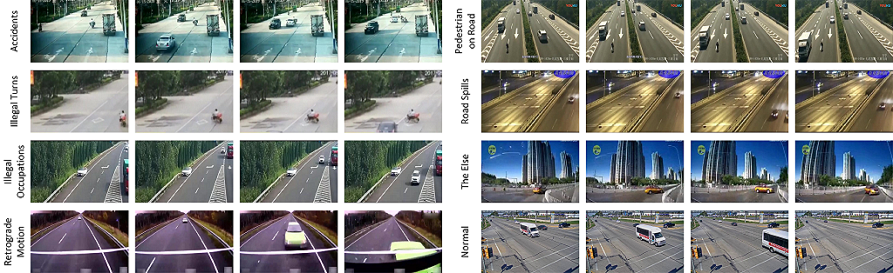

# Codes-for-WSAL
Official implementation for paper: "Localizing Anomalies from Weakly-Labeled Videos".

# Traffic 


A new traffic anomaly dataset is now public available, which is uploaded on [Google Drive](https://drive.google.com/open?id=1cofMJGglil4vddrq_unuy7EEhthMYtuq).

The proposed Traffic dataset contains a total of about 25 hours videos, average 1075 frames per clip. The anomalies randomly occur in each clip, about 80 frames in average. 500 traffic surveillance videos are saved and annotated for anomaly detection, with 250 abnormal and normal videos respectively. The whole dataset is randomly partitioned into two parts: training set with 400 videos, and test set with 100 videos.

Due to the storage restriction, we have uploaded the extracted frames(frames_part_1.zip & frames_part_2.zip) till now. In examples.pdf, we show an example of each anomaly class we collected. The split of training anf testing set will come soon, along with the annotations.

# Data Preparation 
Please download the UCF-Crime dataset first and extract the pre-trained feature following [GCN-Anomaly-Detection] (https://github.com/jx-zhong-for-academic-purpose/GCN-Anomaly-Detection). Then re-organize the data into hdf5 format.

# Training
Run: python Train.py

# Testing
Run: python Test.py

If you find this work helpful, please cite:
```
@article{wsal_tip21,
  author    = {Hui Lv and
	       Chuanwei Zhou and
               Zhen Cui and
               Chunyan Xu and
               Yong Li and
               Jian Yang},
  title     = {Localizing Anomalies from Weakly-Labeled Videos},
  booktitle = {The IEEE Transactions on Image Processing (TIP)},
  year      = {2021}
}
```
